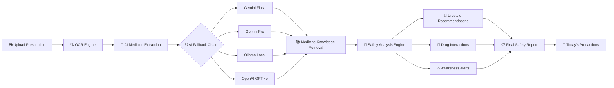
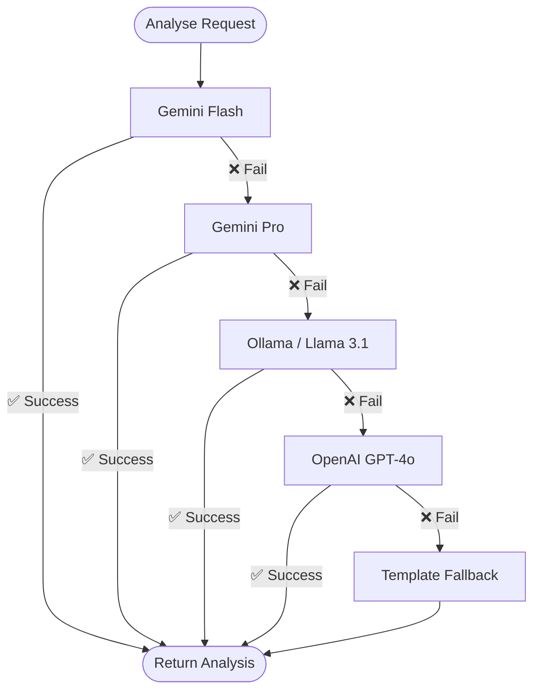

<div align="center">


# 💊 RxLens

### AI-Powered Prescription Safety Assistant

*Bridging the gap between doctor's handwriting and patient understanding.*

<br/>

[](https://www.python.org/)
[](https://fastapi.tiangolo.com/)
[](https://nextjs.org/)
[](https://www.typescriptlang.org/)
[](https://tailwindcss.com/)
[](https://deepmind.google/technologies/gemini/)
[](LICENSE)
[]()

<br/>

[🚀 Quick Start](#-quick-start) · [✨ Features](#-features) · [🏗 Architecture](#-architecture) · [📸 Screenshots](#-screenshots) · [🗺 Roadmap](#-roadmap)

</div>

---

## 📋 Table of Contents

- [The Problem](#-the-problem)
- [Our Solution](#-our-solution)
- [Features](#-features)
- [Tech Stack](#-tech-stack)
- [Architecture](#-architecture)
- [Project Structure](#-project-structure)
- [Quick Start](#-quick-start)
- [Screenshots](#-screenshots)
- [Why RxLens Stands Out](#-why-rxlens-stands-out)
- [Roadmap](#-roadmap)
- [Team](#-team)
- [License](#-license)

---

## 🔴 The Problem

Every day, millions of patients walk out of clinics holding handwritten prescriptions they cannot fully understand.

| Challenge | Impact |
|---|---|
| 💊 Unknown drug interactions | Preventable adverse events go unnoticed |
| 🍊 Food & lifestyle conflicts | e.g. grapefruit + statins, alcohol + benzodiazepines |
| ⚠️ Missed precautions | No sun exposure warnings, no driving alerts |
| 🔍 Basic lookup tools | Existing apps show generic info, not personalised guidance |

> **"Medication errors cause approximately 1 in 10 patient injuries in hospital settings."** — WHO Patient Safety Report

---

## ✅ Our Solution

RxLens turns a photo of a prescription into a complete, personalised safety briefing — in seconds.

```
📷 Prescription Photo
        ↓
🔍 OCR Extraction (Tesseract + OpenCV)
        ↓
🤖 AI Medicine Detection
        ↓
⛓ Multi-Provider AI Fallback Chain
   (Gemini Flash → Gemini Pro → Ollama → OpenAI)
        ↓
📚 Medicine Knowledge Retrieval
        ↓
🧬 Interaction & Safety Analysis
        ↓
🌿 Lifestyle Recommendation Engine
        ↓
📋 Personalised Safety Report
```

The result is a structured report covering identification, dosage, side effects, drug interactions, food conflicts, lifestyle adjustments, and a *"Today's Precautions"* summary — tailored to every medicine on the prescription.

---

## ✨ Features

### Core Capabilities

- [x] 📸 **OCR Prescription Reading** — Tesseract + OpenCV preprocessing for handwritten text
- [x] 🤖 **AI Medicine Extraction** — Identifies medicines, doses, and frequency from raw OCR text
- [x] ⛓ **Multi-Provider AI Fallback Chain** — Automatic failover across providers for high availability
  - Google Gemini Flash (primary)
  - Google Gemini Pro (secondary)
  - Ollama / Llama 3.1:8B (local, offline)
  - OpenAI GPT-4o (cloud fallback)
- [x] 💊 **Comprehensive Medicine Profiles** — Usage, mechanism, dosage, brand names, storage
- [x] 🩺 **Side Effect Analysis** — Common effects vs. rare-but-serious effects, clearly separated
- [x] 🔗 **Drug Interaction Detection** — Cross-medicine interaction warnings with severity ratings
- [x] 🥗 **Food Interaction Warnings** — Grapefruit, alcohol, caffeine, supplement conflicts
- [x] 🌿 **Lifestyle Recommendation Engine** — Categorised into *Avoid*, *Best Practices*, and *Supportive Habits*
- [x] 📅 **Today's Precautions** — Top 3–6 actionable warnings for the current day, sorted by severity
- [x] 📚 **Awareness Alerts** — AI-generated notices for clinically significant risks
- [x] 🕑 **Prescription History** — Browse and revisit past analyses
- [x] 🎨 **Cyberpunk-Inspired UI** — Dark teal theme, compact medicine cards, responsive design

---

## 🛠 Tech Stack

### Frontend

| Technology | Role |
|---|---|
| [Next.js 15](https://nextjs.org/) + React 19 | App framework & routing |
| TypeScript 5 | Type-safe frontend code |
| Tailwind CSS | Utility-first styling |
| Framer Motion | Animations & transitions |
| Lucide React | Icon library |

### Backend

| Technology | Role |
|---|---|
| [FastAPI](https://fastapi.tiangolo.com/) | REST API framework |
| Python 3.11 | Core runtime |
| Pydantic v2 | Data validation & schemas |
| SQLite / PostgreSQL | Prescription storage |

### AI & Machine Learning

| Technology | Role |
|---|---|
| Google Gemini Flash / Pro | Primary AI provider |
| Ollama (Llama 3.1:8B) | Local offline fallback |
| OpenAI GPT-4o | Cloud fallback |
| Tesseract OCR | Handwriting text extraction |
| OpenCV | Image preprocessing |

### Data Sources

| Source | Purpose |
|---|---|
| Medical databases | Reference drug information |
| AI-generated analysis | Personalised safety profiles |
| Web-scraped content | Supplementary medicine data |

---

## 🏗 Architecture



### Provider Fallback Logic



---

## 📁 Project Structure

```text
RxLens/
├── backend/
│   ├── app/
│   │   ├── api/
│   │   │   └── routes/
│   │   │       ├── analysis.py        # AI analysis endpoints
│   │   │       ├── upload.py          # Prescription upload & OCR
│   │   │       ├── prescriptions.py   # History & retrieval
│   │   │       └── health.py          # Health check
│   │   ├── providers/
│   │   │   ├── gemini_provider.py     # Google Gemini integration
│   │   │   ├── ollama_provider.py     # Local Ollama integration
│   │   │   ├── openai_provider.py     # OpenAI fallback
│   │   │   ├── fallback_provider.py   # Template fallback
│   │   │   ├── ocr_provider.py        # Tesseract OCR
│   │   │   └── factory.py             # Provider selection logic
│   │   ├── services/
│   │   │   ├── analysis_service.py    # Core analysis orchestration
│   │   │   ├── llm_service.py         # LLM abstraction layer
│   │   │   └── vector_store_service.py
│   │   ├── schemas/
│   │   │   └── responses.py           # Pydantic response models
│   │   └── main.py                    # FastAPI app entrypoint
│   ├── requirements.txt
│   └── .env.example
│
├── frontend/
│   ├── app/
│   │   ├── page.tsx                   # Landing page
│   │   ├── upload/page.tsx            # Upload flow
│   │   ├── results/page.tsx           # Safety report
│   │   └── history/page.tsx           # Prescription history
│   ├── components/
│   │   ├── MedicineCard.tsx           # Per-medicine tabbed card
│   │   ├── TodaysPrecautions.tsx      # Daily precautions widget
│   │   ├── LifestylePanel.tsx         # Lifestyle recommendations
│   │   ├── SideEffectList.tsx
│   │   ├── DosageSafetyCard.tsx
│   │   ├── WarningCard.tsx
│   │   └── DrowsinessIndicator.tsx
│   ├── services/
│   │   ├── api.ts                     # API client & backend adapter
│   │   └── mockData.ts                # Demo data
│   ├── types/
│   │   ├── medicine.ts                # Core domain types
│   │   └── api.ts                     # API response types
│   └── tailwind.config.ts
│
├── screenshots/
├── README.md
└── docker-compose.yml
```

---

## 🚀 Quick Start

### Prerequisites

Ensure the following are installed on your machine:

| Requirement | Version | Install |
|---|---|---|
| Python | 3.11+ | [python.org](https://www.python.org/downloads/) |
| Node.js | 20+ | [nodejs.org](https://nodejs.org/) |
| Git | Any | [git-scm.com](https://git-scm.com/) |
| Tesseract OCR | 5.x | [Installation guide](https://github.com/tesseract-ocr/tesseract) |
| Ollama | Latest (optional) | [ollama.ai](https://ollama.ai/) |

---

### 1. Clone the Repository

```bash
git clone https://github.com/HackIndiaXYZ/vibe-coding-hackathon-2026-prompt-pirates.git
cd vibe-coding-hackathon-2026-prompt-pirates
```

---

### 2. Backend Setup

```bash
cd backend

# Create and activate a virtual environment
python -m venv .venv

# Windows
.venv\Scripts\activate

# macOS / Linux
source .venv/bin/activate

# Install dependencies
pip install -r requirements.txt
```

---

### 3. Environment Variables

Copy the example environment file and fill in your API keys:

```bash
cp .env.example .env
```

```env
# .env — RxLens Backend Configuration

# AI Providers (at least one recommended)
GEMINI_API_KEY=your_gemini_api_key_here
OPENAI_API_KEY=your_openai_api_key_here        # optional fallback

# Local AI (no key needed if running Ollama)
OLLAMA_URL=http://localhost:11434
OLLAMA_MODEL=llama3.1:8b

# OCR
TESSERACT_CMD=/usr/bin/tesseract              # or C:/Program Files/Tesseract-OCR/tesseract.exe

# App
DEBUG=true
ALLOWED_ORIGINS=http://localhost:3000
```

> 💡 **Tip:** RxLens can work without any API keys using the local Ollama provider.

---

### 4. Start the Backend

```bash
# From the backend/ directory (with venv activated)
uvicorn app.main:app --reload --port 8000
```

The API will be available at `http://localhost:8000`.  
Interactive docs: `http://localhost:8000/docs`

---

### 5. (Optional) Set Up Ollama for Local AI

```bash
# Pull the model (~4.7 GB)
ollama pull llama3.1:8b

# Start the Ollama server
ollama serve
```

---

### 6. Frontend Setup

```bash
# Open a new terminal
cd frontend

# Install dependencies
npm install

# Start the development server
npm run dev
```

The app will be available at **[http://localhost:3000](http://localhost:3000)** 🎉

---

### 7. Verify Everything is Running

| Service | URL | Status |
|---|---|---|
| Frontend | http://localhost:3000 | Next.js dev server |
| Backend API | http://localhost:8000 | FastAPI + Uvicorn |
| API Docs | http://localhost:8000/docs | Swagger UI |
| Ollama (optional) | http://localhost:11434 | Local LLM server |

---

## 📸 Screenshots

<div align="center">

### 🏠 Landing Page

*Clean, minimal entry point with upload prompt*

---

### 📤 Upload Prescription

*Drag-and-drop prescription image upload with real-time preview*

---

### 📊 AI Analysis Dashboard

*Full safety report with medicine cards, confidence score, and provider info*

---

### ⚠️ Awareness Alerts

*Clinically significant risk notices, clearly separated from common side effects*

---

### 🌿 Lifestyle Recommendations

*Categorised guidance: What to Avoid · Best Practices · Supportive Habits*

---

### 📅 Today's Precautions

*Top 3–6 most important actions for the day, sorted by severity*

---

### 🕑 Prescription History

*Browse and revisit past prescription analyses*

</div>

---

## 🧠 Why RxLens Stands Out

Most prescription tools stop at medicine lookup. RxLens is a full safety intelligence layer.

```
Generic Lookup App          RxLens
───────────────────         ──────────────────────────────────────
✅ Medicine name            ✅ Medicine name + mechanism
✅ Basic dosage             ✅ Dosage + missed dose + overdose guidance
❌ No side effect triage    ✅ Common vs. rare-but-serious, clearly separated
❌ No interaction checks    ✅ Drug-drug + food-drug interactions with severity
❌ No lifestyle advice      ✅ Avoid / Best Practices / Supportive Habits
❌ No daily summary         ✅ "Today's Precautions" — actionable, emoji-coded
❌ Single AI model          ✅ 4-provider fallback chain for high availability
❌ Generic UI               ✅ Cyberpunk dark-teal theme, collapsible medicine cards
```

The combination of **computer vision** (OCR + OpenCV), **multiple AI models** (Gemini, Ollama, OpenAI), **clinical heuristics** (drug class-based lifestyle rules), and a **patient-first UX** makes RxLens uniquely positioned to deliver real-world value.

---

## 🗺 Roadmap

| Priority | Feature | Status |
|---|---|---|
| 🔴 High | Voice assistant integration | Planned |
| 🔴 High | Mobile app (React Native) | Planned |
| 🟡 Medium | Multi-language prescription support | In Design |
| 🟡 Medium | Doctor / pharmacist dashboard | In Design |
| 🟡 Medium | Medicine reminder notifications | Planned |
| 🟢 Low | EHR (Electronic Health Record) integration | Planned |
| 🟢 Low | Cloud deployment (Docker + CI/CD) | In Progress |
| 🟢 Low | AI confidence scoring & consensus engine | In Design |

---

## 👥 Team

<div align="center">

| Member | Role |
|---|---|
| [Tarun Vaidhyanadhan](https://github.com/tarunvaidhyanadhan2025-netizen) | FUll Stack Developer |
| [Sanjeev V](https://github.com/sanjeevvr11) | Full Stack Developer |


*Built with ❤️ for [Vibe Coding Hackathon 2026]*

</div>

---

## 📄 License

```
MIT License

Copyright (c) 2026 HackIndia

Permission is hereby granted, free of charge, to any person obtaining a copy
of this software and associated documentation files (the "Software"), to deal
in the Software without restriction, including without limitation the rights
to use, copy, modify, merge, publish, distribute, sublicense, and/or sell
copies of the Software, and to permit persons to whom the Software is
furnished to do so, subject to the following conditions:

The above copyright notice and this permission notice shall be included in all
copies or substantial portions of the Software.

THE SOFTWARE IS PROVIDED "AS IS", WITHOUT WARRANTY OF ANY KIND, EXPRESS OR
IMPLIED, INCLUDING BUT NOT LIMITED TO THE WARRANTIES OF MERCHANTABILITY,
FITNESS FOR A PARTICULAR PURPOSE AND NONINFRINGEMENT. IN NO EVENT SHALL THE
AUTHORS OR COPYRIGHT HOLDERS BE LIABLE FOR ANY CLAIM, DAMAGES OR OTHER
LIABILITY, WHETHER IN AN ACTION OF CONTRACT, TORT OR OTHERWISE, ARISING FROM,
OUT OF OR IN CONNECTION WITH THE SOFTWARE OR THE USE OR OTHER DEALINGS IN THE
SOFTWARE.
```

---

<div align="center">

**⭐ If RxLens helped you or impressed you, please star the repository!**

<br/>

[](https://github.com/HackIndiaXYZ/vibe-coding-hackathon-2026-prompt-pirates)
[](https://github.com/HackIndiaXYZ/vibe-coding-hackathon-2026-prompt-pirates/fork)

<br/>

*Made with 💊 and a lot of ☕ — RxLens Team*

</div>
